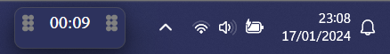

# Electron stopwatch

Goal of this app was to have discrete stopwatch that would reside on windows taskbar or anywhere on the screeen.
It would be used to e.g. track productivity.
I made it because the windows native stopwatch widget seemed too big for me, and i found no reliable replacement

### Example use

## How to use
It's simple, left mouse button on the value for toggle start/pause and right button for reset.

## Installation
1. npm is needed
2. run `npm install` in directory with downloaded files
3. next run `npm run make`
4. for windows the app should be found in `./out/electron_stopwatch-win32-x64/electron_stopwatch.exe`

I'm aware that there is a way of publishing this as casual installable app but it seems that it needs to be code signed (which costs)

## Issues
1. For some reason app is started in undesirable size. It's too tall and only by first drag it changes to intended size.
2. When app is pinned to windows taskbar the clock icon is change to default Electorn logo